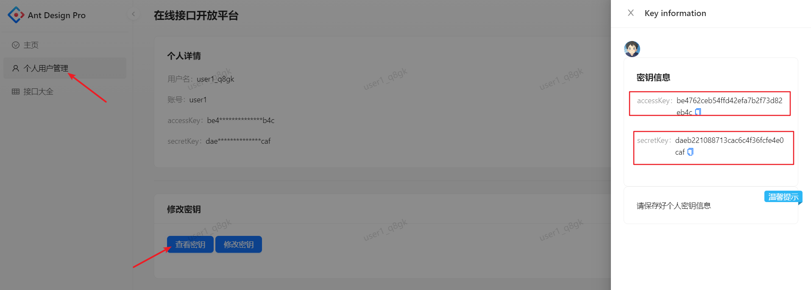

## Gm API 开放平台-Java SDK

> 基于 Spring Boot Starter 开发
>
> 平台地址：https://api.jishuqin.cn
>
> 作者：顾梦

### 快速开始

#### 1. 引入 依赖

```
<dependency>
    <groupId>cn.jishuqin.gmapiclientsdk</groupId>
    <artifactId>gmapi-client-sdk</artifactId>
    <version>1.0.0</version>
</dependency>
```

#### 2. 登录 Gm API开放平台 获取密钥对



#### 3. 初始化 GmApiClient 对象

- 方法1：自身创建对象

  ```java
  String accessKey = "your-accessKey";
  String secretKey = "your-secretKey";
  GmApiClient client = new GmApiClient(accessKey, secretKey);
  ```

- 方法2：通过配置注入对象

  在 application.yml 添加配置：

  ```yaml
  gmapi:
    client:
      access-key: your-accessKey
      secret-key: your-secretKey
  ```

  使用客户端对象：

  ```java
  @Autowired
  private GmApiClient client;
  ```

#### 4. 构造参数

- GET 请求

```java
// 设置请求类型和接口地址
Api api = new Api("GET","/weather/weatherInfo");

// 根据请求参数描述设置对应参数，无需参数则不需要设置
Map< String,Object > params = new HashMap<>();
params.put("city","广州");
api.setParams(params);
```

- POST 请求

```java
// 设置请求类型和接口地址
Api api = new Api("POST","/random/Content");

Map< String,String > map = new HashMap<>();
// 根据请求参数描述，设置相应参数
map.put("type","reading");
// 转 json 格式
String jsonStr = JSONUtil.toJsonStr(map);
// 传入请求参数
api.setBody(jsonStr);
```

#### 5.获取响应结果

```java
String result = client.getResult(api);
System.out.println(result);
```

#### 6. 联系站长

- 有其他疑问可以发送邮件联系我，[Email](mailto:374943980@qq.com)

- 想了解更多，可以访问我的个人主页。[顾梦の主页](https://gumengyo.top/)
- To learn more, you can visit my personal page.[Gumeng's page](https://gumengyo.top/)
