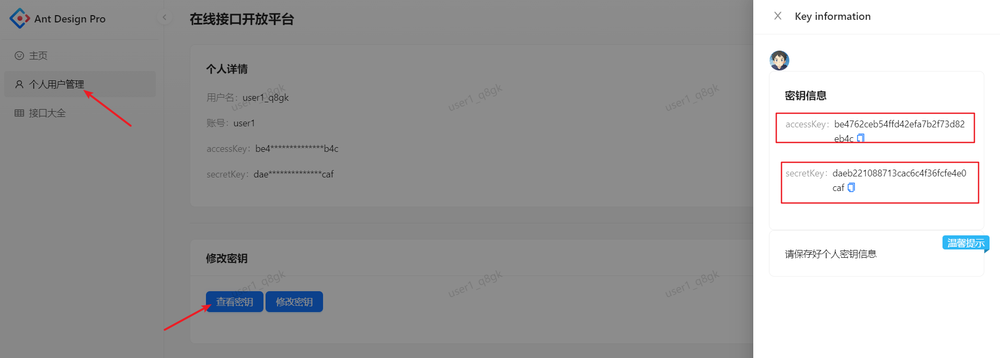

## Gm Api 开放平台-Java SDK

基于 Spring Boot Starter 开发

项目地址：http://api.jishuqin.cn

### 快速开始

#### 1. 引入 依赖

```
<dependency>
    <groupId>com.gumeng</groupId>
    <artifactId>gmapi-client-sdk</artifactId>
    <version>0.0.2</version>
</dependency>
```

#### 2. 登录 Gm Api 开放平台 获取密钥对



#### 3. 初始化 GmApiClient 对象

- 方法1：自身创建对象

  ```java
  String accessKey = "your-accessKey";
  String secretKey = "your-secretKey";
  GmApiClient client = new GmApiClient(accessKey, secretKey);
  ```

- 方法2：通过配置注入对象

  在 application.yml 添加配置：

  ```yaml
  gmapi:
    client:
      access-key: your-accessKey
      secret-key: your-secretKey
  ```

  使用客户端对象：

  ```java
  @Resource
  private GmApiClient client;
  ```

#### 4. 构造请求参数

```java
Api api = new Api();
// 设置请求路径 /api 之后的部分
api.setUrl("/random/Content");
// 设置请求方法
api.setMethod("POST");
// 设置接口id
api.setInterfaceId("4");
Map map = new HashMap<>();
// 根据请求参数描述，设置相应参数
map.put("type","reading");
// 转 json 格式
String jsonStr = JSONUtil.toJsonStr(map);
// 传入请求参数
api.setBody(jsonStr);
```

#### 5. 获取响应结果

```java
String result = client.getResult(api);
System.out.println(result);
```
